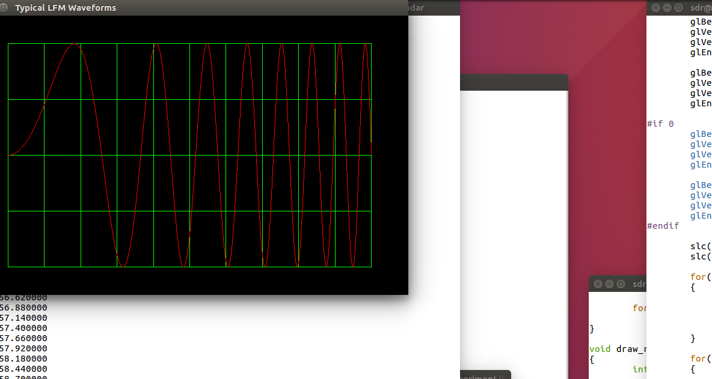

# RadarBasedQuadcopter
Radar Based Quadcopter

# Master
- Sanghoon Lee:		gcccompil3r@gmail.com

# Members
- Byungjun Kim:		peterbj95@kaist.ac.kr
- Chiho Won:
- Daero Lee:		skseofhek@daum.net
- Hyeondae Jo:		whguseo456@gmail.com
- Hyunho Cha:		gusgh0758@naver.com
- Kisaragi Hayato:	fpga114@gmail.com
- Seongcheol Ryu:	zakra90@gmail.com
- Seongwook Choi:	chltjddnr0414@gmail.com
- Seunghan Han:		hah2461@naver.com

# How to compile
1. go to 'experiment/radar' directory.
2. make
3. If wanna debug then enter below command at terminal.

export CFLAGS="-g -O0 -DDEBUG"  
make

# Results

